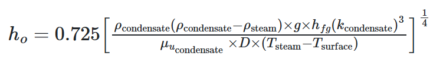
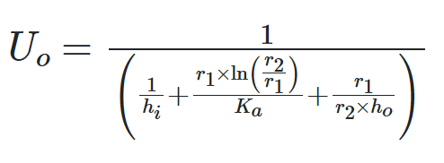
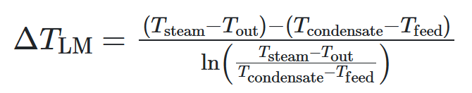
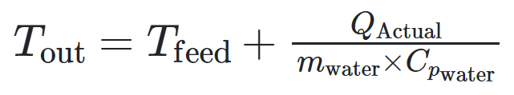

## PROCEDURE

#### Note : Truncate the final calculated value to 2 digits after the decimal point in all calculations

### I.  Boiler calculations
- Find the enthalpy of steam hg (kJ/kg) at the given temperature. Click on '**Refer**' to refer the value and submit your answer
- Similarly, find the Enthalpy of feed water hf (kJ/kg) and submit your answer 
- Select Mass flow rate for steam msteam (kg/hr) and submit your answer
- Calculate energy required for feedwater to reach boiler at given temperature at startup phase of boiler Q(W), use the below formula for calculation and submit your answer  
    Q = Msteam &times; Cpwater &times; &Delta;T
- Calculate time required t (min) using below formula and submit your answer  
    t = Q / Qelectric
- Click on '**Next**' and proceed to the next level

 ### II.  Heat exchanger water side calculations  
 -   Calculate flow rate of water (m3/s) using the below formula and submit your answer  
    flowwater = mwater/(3600 &times; ρwater)   
-  Calculate area of inner pipe Awater using the below formula and submit your answer   Area = &pi; &times; r12, where &pi; = 3.14
- Calculate speed of water Vwater using the below formula and submit your answer  
   Vwater = flowwater/Awater 
- Calculate  Reynold's number for water (Rewater) using the below formula and submit your answer   
Rewater = (Vwater × r1 × 2 × ρwater) / μwater
- Calculate Prandtl number for water (Prwater) using the below formula and submit your answer  
 Prwater = ( μwater &times; Cpwater) / kwater
 - Calculate Nusselt number for water (Nuwater for heating) Nuwater using the below formula and submit your answer  
 Nuwater = 0.023 ( Rewater0.8 Prwater0.4)
 - Calculate heat transfer coefficient of water (hi) using below formula and submit your answer  
  hi = (Nuwater &times; kwater) / 2 r1
- Click on '**Next**' and proceed to the next level

 ### III.  Heat exchanger steam side calculations 
 - Find hfg (J) at steam from steam table at the given temperature. Click on '**Refer**' to refer the value and submit your answer
 - Calculate heat transfer coefficient of steam for pure condensation ho (W/m2.oC) using the below formula and submit your answer  

    

- Calculate Overall heat transfer coefficient Uo (W/m2.oC) using the below formula and submit your answer  

     

- Calculate Log mean temperature difference &Delta;TLM (oC) using the below formula and submit your answer  
       
       

 - Calculate Surface area of inner tube SA (m3) using the below formula and submit your answer  
     SA = &pi; &times; 2 &times; r1 &times; l
 - Calculate maximum heat exchanges heat transfer Qhx using the below formula and submit your answer   Qhx = Uo &times; SA &times; &Delta;TLM
- Click on '**Next**' and proceed to the next level

  ### IV. Outlet temperature of water calculations   
- Calculate Maximum possible heat from steam given Qsteam using the below formula and submit your answer  
 Qsteam = (msteam &times; hfg) + (msteam &times; Cpwater &times; (Tsteam - Tcondensate))
 - Calculate Actual Energy transfer QActual using the below formula and submit your answer  
    QActual = min (Qhx , Qsteam)
  - Calculate Temperature of outlet water Tout using the below formula and submit your answer  
      
       

- Select the appropriate to get Tout to 60 oC and submit your answer    
- Click on '**Result**' for performance accessment

